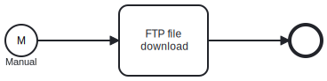

Long description of the template is the main place where we explain the
purpose of the template and what exactly does it do. This is a good place
to put any instructions for setting this template up and what are the 
things that developers should pay attention to when using this template.

The template should start straight out with plain text as it will be 
placed directly below template name on the template portal, so no
**description** header is needed.

This example template is a simple process that downloads files from an FTP
server and saves then to a local directory.

# Prerequisites

This template assumes that the following prerequisites are in place:

- The FTP server user should have the permissions to connect and access 
  the files that Frends needs to download.
- The Frends agent has access to the target directory where the files
  should be saved locally.

# Implementation and Usage Notes

This template only downloads files from the FTP server to local directory,
it does not handle cleanup of the local directory, so cleaning or local file
processing should be done separately.

# Error Handling

This template does not handle transient errors separately, however the connection
to the FTP server is retries three time before failing.

This template does not handle issues with local file access separately, so
in case file write error occur the process execution will fail with an appropriate
error message.
