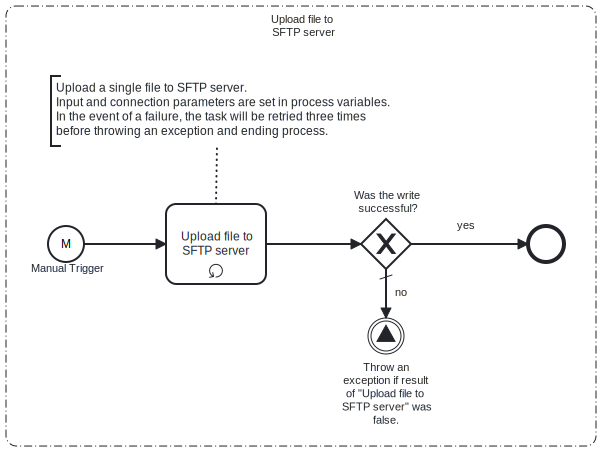

This Process will read a file from a **local file system**, and move it without any processing to an **SFTP Server** location.

# Prerequisites

This template assumes that the following prerequisites are in place:

- The Frends agent has access to the local fileshare where the file has been saved.
- The SFTP server user should have the permissions to connect and write the files that Frends needs to upload.

# Implementation and Usage Notes

This template only reads a file from the local fileshare and uploads it to an SFTP server.
It does not handle cleanup of the local directory, so cleaning or local file processing should be done separately.
Teh process will overwrite the file if it is already in existence on the target SFTP server.  

# Error Handling

This template does not handle transient errors separately, however when connecting
to the **SFTP server** it retries **three** times before failing.

This template does not handle issues with local file access separately, so
in case file read error occurs the process execution will fail with an appropriate
error message.
