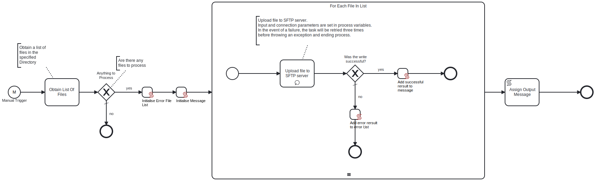

This Process will read a list file from a **local fileshare** based on a **file mask**, and move each file without any processing to an **SFTP Server** location.

# Prerequisites

This template assumes that the following prerequisites are in place:

- The Frends agent has access to the local fileshare where the files have been saved.
- The SFTP server user should have the permissions to connect and write the files that Frends needs to upload.

# Implementation and Usage Notes

This template only reads files from the local fileshare or file system and uploads the files to an SFTP server.
It does not handle cleanup of the local directory, so cleaning or local file processing should be done separately.

# Error Handling

This template does not handle transient errors separately, however when connecting
to the **SFTP server** it retries **three** times before failing.

This template does not handle issues with local file access separately, so
in case file read error occurs the process execution will fail with an appropriate
error message.