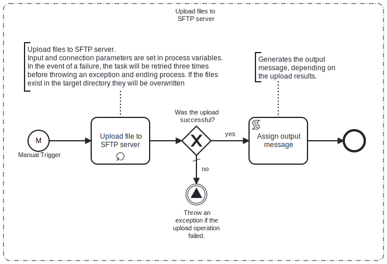

This Process will upload files from a **local filesystem** based on a **file mask** to an **SFTP Server** location.

# Prerequisites

This template assumes that the following prerequisites are in place:

- The Frends agent has access to the local files that need to be uploaded.
- The SFTP server user should have the permissions to connect and write the files that Frends needs to upload.

# Implementation and Usage Notes

This template only reads files from the local fileshare or file system and uploads the files to an SFTP server.

The template does not handle cleanup of the local directory, so cleaning or local file processing should be configured separately. The upload task has different options for the action to take after files have been successfully uploaded (delete, rename or move).

If the target directory on the SFTP server already contains files with same names - they will be overwritten by the upload operation. If needed this action can be configured in the upload task (the task can overwrite, append or procuce an error in this situation).

# Error Handling

This template does not handle transient errors separately, however when connecting
to the **SFTP server** it retries **three** times before failing.

This template does not handle issues with local file access separately, so
in case file read error occurs the process execution will fail with an appropriate
error message.
