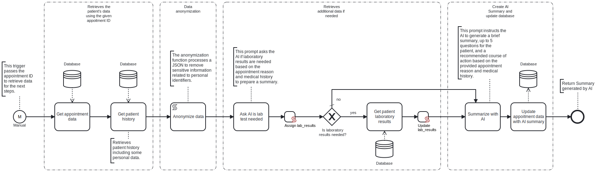

This template process retrieves a patient’s history from the database, anonymizes the data, generates an AI summary for the doctor, and saves it in the database.



# Prerequisites

This template assumes that the following prerequisites are in place:

- Frends agent has access to the Microsoft SQL Server database, with the necessary permissions to select and update data
- The tables from which data is retrieved and into which data is updated must already be configured

# Implementation and Usage Notes

This template retrieves patient data from a Microsoft SQL database using a given appointment ID from the trigger. While a Microsoft SQL database is used in this template, users can modify process to retrieve data from any source, such as a different database, API or files.

Once the data is retrieved, it is anonymized by removing personal information like names and SSNs. This anonymization process can be adjusted depending on the source and structure of the patient data.

After anonymization, an initial message is sent to ChatGPT to check if additional data, such as lab test results, is needed for the patient’s case. While ChatGPT is used in this template, users can replace it with any AI model. If more data is required, it is retrieved from anoter table and included in the next step. This process can be adjusted based on requirements and available additional data sources.

Next, the complete set of relevant data is sent in a message to ChatGPT to generate a patient summary for the doctor. Additionally, the message content can be customized based on the available data and desired output.

Finally, the generated summary is used to update an existing table with appotiments data. The way the genreated summary is handled may vary depending on specific requirements.

**Example patient data**

```
Patient data:

{
  "patient_id": 1,
  "first_name": "John",
  "last_name": "Doe",
  "date_of_birth": "1985-06-15",
  "ssn": "123-45-6789",
  "gender": "Male"
}

Medical history:

{
  "history_id": 1,
  "patient_id": 1,
  "condition": "Diabetes, type 2",
  "diagnosis_date": "2020-05-10",
  "notes": "Controlled using Metformin"
}

Laboratory results:

{
  "lab_id": 1,
  "patient_id": 1,
  "test_name": "Complete blood count",
  "result-value": "Normal",
  "test_date": "2024-02-01"
}

Appointment data:

{
  "appointment_id": 1,
  "patient_id": 1,
  "appointment_date": "2024-03-05",
  "reason": "Routine check-up",
  "ai_summary": "null"
}
```

# Error Handling

This template does not handle transient errors separately

The template does not handle any SQL or connection to AI Model errors that may occur.
