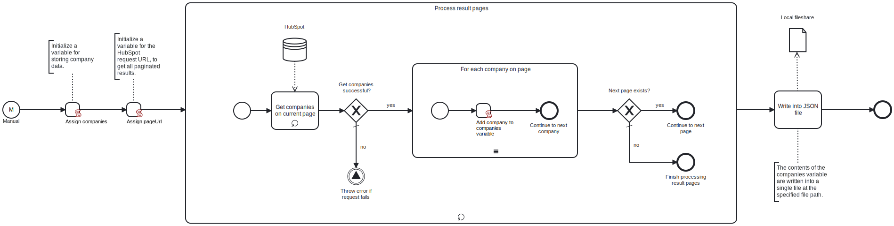

This template retrieves company data from HubSpot and downloads it to a local fileshare as a single JSON file.

# Prerequisites

This template assumes that the following prerequisites are in place:

- HubSpot API key is accessible.
- The Frends agent has access to the local fileshare to which the resulting JSON file will be saved.
- No file with the same name exists in the selected file path.

# Implementation and Usage Notes

The template makes a single call to the HubSpot API, returning the company data in JSON format. You can adjust the fetched company properties and associations within the process variables. 

The full path to which the file is saved, including the file name, is determined in the process variables.

# Error Handling

This template does not include error handling.
