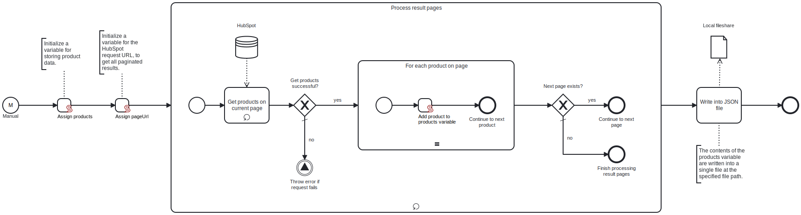

This template retrieves product data from HubSpot and downloads it to a local fileshare as a single JSON file.

# Prerequisites

This template assumes that the following prerequisites are in place:

- HubSpot API key is accessible.
- The Frends agent has access to the local fileshare to which the resulting JSON file will be saved.

# Implementation and Usage Notes

This template retrieves products from the HubSpot API, which returns paginated results with each page displaying a maximum of 100 products. In case more than one result page exists, the template makes sequential calls to fetch each page, using the URL provided in the `paging.next.link` property of the previous response. The processing of pages continues until no next page link is found.

The products from each page are collected into a JArray list in JSON format. You can adjust the fetched product properties within the process variables. 

After processing all results, the product data is written to a single JSON file. The full path to which the file is saved, including the file name, is determined in the process variables. If a file with the same name exists in the specified path, the file will be overwritten. You can change this in the write task's settings.

# Error Handling

If a request to the HubSpot API fails, the template throws an exception stating the error message and stops without writing the file. For any transient errors, the connection to HubSpot is tried 5 times with each request.
