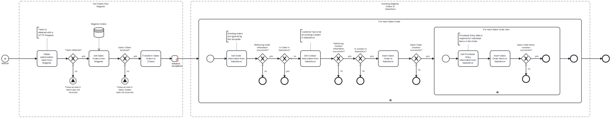

This template exports sales orders from Magento and imports them to Salesforce.
Using this template, you can insert sales order and order products data from Magento to Salesforce.

# Prerequisites

This template assumes that the following prerequisites are in place:

- The Salesforce user should have access to client ID, secret and security token.
- Magento customer has been added as a contact in Salesforce with account information.
- Because products are uniquely identified with product codes, products from Magento should be added to Salesforce using the appropriate template before using this template.

# Implementation and Usage Notes

This template uses Salesforce queries to get information about orders, contacts and price books.
Process variables include credentials fields for both Salesforce and Magento.

# Error Handling

Error handling is not implemented in this template.
However, if transient errors are expected, retries for Salesforce and Magento connections can be enabled from the tasks.