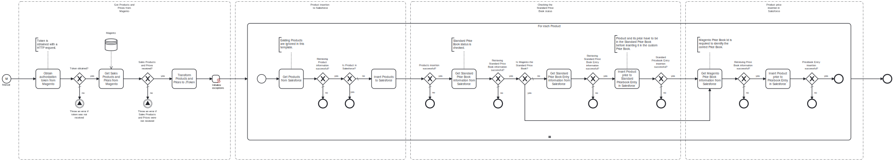

This template inserts Magento products and their corresponding prices to Salesforce.
Using this template, you can insert your new Magento products to Salesforce.

# Prerequisites

This template assumes that the following prerequisites are in place:

- The Salesforce user should have access to client ID, secret and security token.
- Price book for Magento is initialized in Salesforce. It is labelled as "Magento Price Book" in this template.

# Implementation and Usage Notes

This template uses Salesforce queries to identify a product and the price book it's connected to. The price book, in which the product price is inserted, can be changed by altering the name in the price book task parameters.
Process variables include fields for both Salesforce and Magento credentials.

# Error Handling

Error handling is not implemented in this template.
However, if transient errors are expected, retries for connections with Magento and Salesforce can be enabled from the tasks.