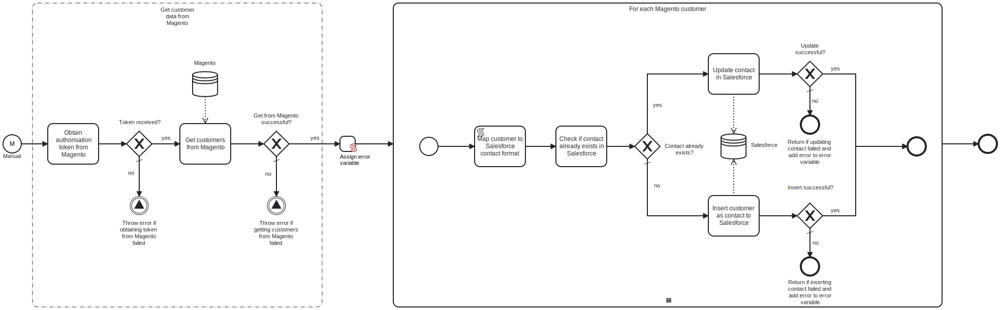

This template synchronizes customers from Adobe Commerce / Magento to Salesforce as Contacts.
Using this template, you can synchronize the list of customers and their details from Magento to Salesforce.

# Prerequisites

This template assumes that the following prerequisites are in place:

- The Magento user should be eligible to obtain an admin authorization token from Magento.
- The Salesforce user should have access to client ID, secret and security token.

# Implementation and Usage Notes

This template fetches all the customers from Magento, and then either inserts or updates them as Contacts in Salesforce. To determine if a Magento customer already has a corresponding Contact in Salesforce, the email addresses of the Magento customers are compared to those of the existing Contacts in Salesforce.

The credentials and URLs for connecting to both Magento and Salesforce are supplied to the template through defining the values in the corresponding process variables.

# Error Handling

Error handling is not implemented in this template.
However, if transient errors are expected, retries for Salesforce connection and database queries can be enabled from the tasks.