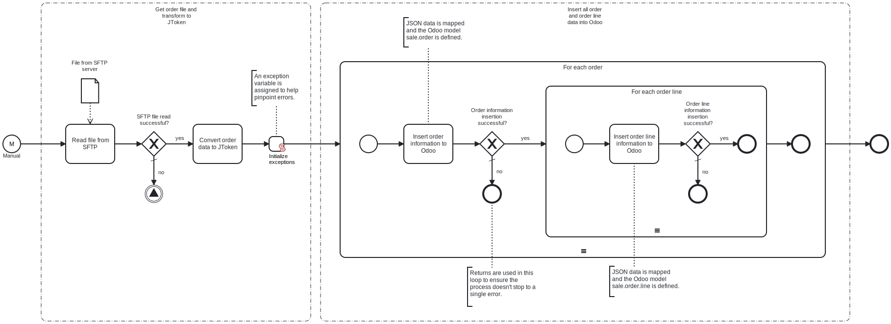

This template will retrieve an order file from an SFTP server. It will perform the necessary mapping to Odoo order format, and transfer the mapped orders to Odoo.
Using this template, you can insert new orders to Odoo.



# Prerequisites

This template assumes that the following prerequisites are in place:

- SFTP address, username and password are required to access the file.
- Odoo user exists for performing the synchronization.
- Odoo has a database with usable products, partners, addresses and a pricelist for the synchronization.

# Implementation and Usage Notes

This template is used to insert order data to Odoo using Odoo models for order and order line. Other properties, such as activation, deactivation and deletion is not implemented in this template.
Process variables include fields for both SFTP and Odoo credentials, SFTP and Odoo addresses, SFTP file path, SFTP file name and Odoo database name.

**Example JSON data**

```
{
  "orders": [
      {
          "name": "SO001",
          "date_order": "2024-06-01",
          "partner_id": "30",
          "partner_invoice_id": "30",
          "partner_shipping_id": "88",
          "pricelist_id": "1",
          "order_line": [
              {
                  "customer_lead": "0",
                  "display_type": "line_section",
                  "product_id": null,
                  "product_name": "Section A",
                  "product_uom": null,
                  "product_uom_qty": "0",
                  "price_unit": "0",
                  "tax_name": "VAT 15%"
              },
              {
                  "customer_lead": "2",
                  "display_type": null,
                  "product_id": "5",
                  "product_name": "Product B",
                  "product_uom": "1",
                  "product_uom_qty": "1",
                  "price_unit": "100",
                  "tax_name": "VAT 15%"
              }
          ],
          "amount_total": 200.0,
          "state": "sale"
      }
  ]
}

```

# Error Handling

There are error checks after the tasks for reading the SFTP file and inserting Odoo data. If a task is not successful, error message will be appended to an exception variable and displayed at the end of the process. Next order or order line is handled after an error.
Transient errors are not handled in this template, but if they are expected, retries for reading the file, data transform and Odoo insertions can be enabled from their tasks.