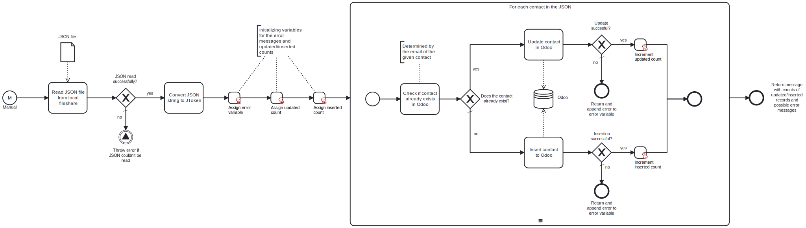

This template process reads a **JSON** file containing contact information from the local fileshare, and either creates or updates the contacts into **Odoo**. With this template, you can insert or update a batch of contacts to Odoo. The contacts can either be companies or individuals.



# Prerequisites

This template assumes that the following prerequisites are in place:

- The **Odoo** user has permissions to insert contacts using the API.


# Implementation and Usage Notes

This template process reads **JSON** data, and inserts or updates contacts into **Odoo** based on the data. Whether a contact should be inserted or updated is determined by comparing the emails of the existing contacts in Odoo to the ones read from the JSON. If a contact with a given email doesn't exist, it is created, otherwise the existing contact is updated.

The connection parameters for Odoo and the path and name of the JSON file to be read are determined in the Process Variables.

The available fields are `name`, `is_company`, `street`, `city`, `zip`, `phone`, `mobile`, `email`, `website`, `customer_rank`, `supplier_rank`, `vat` and `comment`.

**Example input JSON structure**

```
[
  {
    "name": "ABC Corporation",
    "is_company": true,
    "street": "123 Elm Street",
    "city": "Springfield",
    "zip": "12345",
    "phone": "+1234567890",
    "email": "info@example.com",
    "website": "http://www.example.com",
    "customer_rank": 3,
    "supplier_rank": 0,
    "vat": "12345",
    "comment": "Important client with high priority."
  },
  {
    "name": "Jane Doe",
    "is_company": false,
    "street": "456 Oak Street",
    "city": "Springfield",
    "zip": "12345",
    "phone": "+1234567891",
    "mobile": "+1234567892",
    "email": "jane.doe@example.com",
    "customer_rank": 1,
    "supplier_rank": 0,
    "vat": "54321",
    "comment": "Preferred contact for ABC Corporation."
  },

  .
  .
  .
]
```
# Error Handling

This template does not handle transient errors separately.

If inserting or updating a contact fails, a mention of it will be added to the return message of the process.
