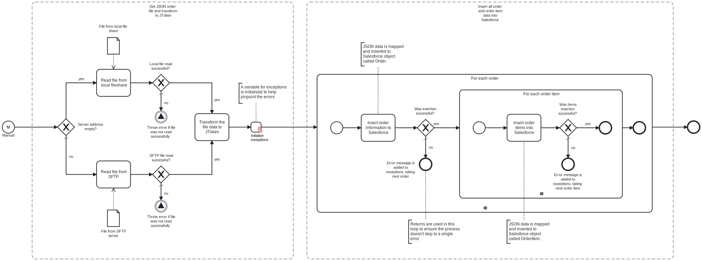

This template will retrieve a Sales Orders file from a local file system or an SFTP server. It will perform the necessary mapping to Salesforce Sales Order format, and transfer the mapped Sales Orders to Salesforce.
Using this template, you can insert new Orders to Salesforce.

# Prerequisites

This template assumes that the following prerequisites are in place:

- If SFTP connection is used, username and password for the server are required.
- The Salesforce user should have access to client ID, secret and security token.

# Implementation and Usage Notes

This template is used to insert new Order data to Salesforce. Other properties, such as activation, deactivation and deletion is not implemented in this template.
Process variables include fields for Salesforce and SFTP credentials, file path and file name.

# Error Handling

Error handling is not implemented in this template.
However, if transient errors are expected, retries for reading the file, data transform and Salesforce insertion can be enabled from their tasks.