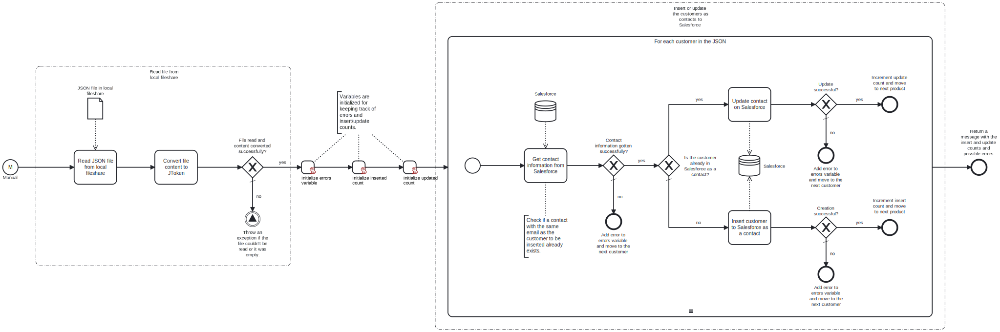

This template process reads customer information from a **JSON** file in the local fileshare and creates or updates the customers in **Salesforce** as contacts.
Using this template, you can insert or update customers into Salesforce as contacts.



# Prerequisites

This template assumes that the following prerequisites are in place:

- The Salesforce user should have access to the client ID, secret and security token.

# Implementation and Usage Notes

This template reads a JSON file from the local fileshare containing customer data and creates or updates the customers as contacts into Salesforce.
Process variables include fields for the Salesforce credentials and the path to the input file.

**Sample JSON data:**

```json
[
    {
        "Email": "customer.one@example.com",
        "Fax": "12345678",
        "FirstName": "First",
        "LastName": "Customer",
        "MailingCity": "Helsinki",
        "MailingCountry": "Finland",
        "MailingPostalCode": "00100",
        "MailingStreet": "Example Street 1",
        "MailingState": "Uusimaa",
        "OtherCity": "Espoo",
        "OtherCountry": "Finland",
        "OtherPostalCode": "02250",
        "OtherStreet": "Example Lane 5",
        "OtherState": "Uusimaa",
        "OtherPhone": "1122334455",
        "MobilePhone": "0033445566",
        "HomePhone": "0011223344",
        "Phone": "0022334455",
        "Salutation": "Mrs.",
        "Title": "CEO",
        "Description": "This is a very important customer.",
        "AssistantName": "Mr. Smith",
        "AssistantPhone": "0044332211"
    },
    {
        "Email": "customer.two@example.com",
        "Fax": "87654321",
        "FirstName": "Second",
        "LastName": "Customer",
        "MailingCity": "London",
        "MailingCountry": "United Kingdom",
        "MailingPostalCode": "12345",
        "MailingStreet": "Example Lane 3",
        "MobilePhone": "+123123213",
        "Phone": "+321321321",
        "Salutation": "Dr.",
        "Title": "Vice President",
        "Description": "This is a business partner.",
        "AssistantName": "Ms. Green",
        "AssistantPhone": "0011223344"
    }
]
```

# Error Handling

This template checks for errors after each task, and proceeds accordingly. If an error is encountered when e.g., creating a contact into Salesforce, the process moves on to the next customer and an error message is appended to the error variable which is displayed at the end of the process.
If transient errors are expected, retries for the file read and Salesforce connections can be configured in the tasks.