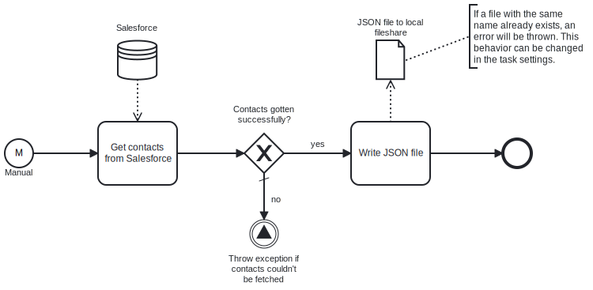

This template process retrieves the list of contacts from Salesforce and writes the information as a JSON file to the local fileshare.
Using this template, you can retrieve the list of contacts from Salesforce and store it locally as JSON.

# Prerequisites

This template assumes that the following prerequisites are in place:

- The Salesforce user should have access to the client ID, secret and security token.

# Implementation and Usage Notes

This template fetches contacts from Salesforce and stores the information into a local JSON file.
Process variables include fields for the Salesforce credentials and the output file path. If a file with the same name already exists, by default the process will throw an error - this behavior can be changed in the task settings.

# Error Handling

This template checks for errors after attempting to get the contact information from Salesforce.
If transient errors are expected, retries for the file write and Salesforce connections can be configured in the corresponding tasks.