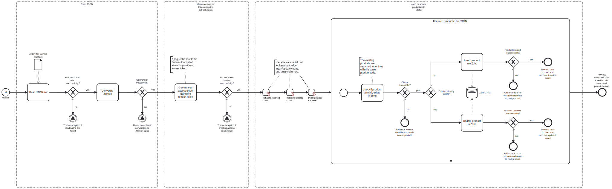

This template process reads a JSON file containing product data and either inserts or updates the products into Zoho CRM.



# Prerequisites

This template assumes that the following prerequisites are in place:

- You have a refresh token for the Zoho API. One can be created using the corresponding template.
- The client ID and client secret for Zoho are available.
- It is known which domain your Zoho instance is in, e.g., EU or America.
- The Frends agent has access to the folder from which the JSON file should be read.

# Implementation and Usage Notes

This template reads product information from a JSON file and inserts or updated the products into Zoho CRM. To determine if a product should be inserted or updated, the product codes of the existing products on Zoho CRM are compared to the codes of the products to be inserted or updated.

This template assumes that the input JSON structure is correct and uses the field names that the Zoho API expects. The template does not perform any mapping for the JSON data.

The process variables include the regional domain URLs for your Zoho instance, 

**Sample input JSON structure**

```json
[
  {
    "Product_Category": null,
    "Qty_in_Demand": 0,
    "Owner": {
      "name": "example",
      "id": "123456789",
      "email": "example@example.com"
    },
    "Description": null,
    "$currency_symbol": "$",
    "Vendor_Name": null,
    "$field_states": null,
    "$review_process": {
      "approve": false,
      "reject": false,
      "resubmit": false
    },
    "Sales_Start_Date": null,
    "Tax": [],
    "Product_Active": true,
    "Record_Image": null,
    "Modified_By": {
      "name": "example",
      "id": "123456789",
      "email": "example@example.com"
    },
    "$review": null,
    "Product_Code": "PROD1",
    "$state": "save",
    "$process_flow": false,
    "Manufacturer": null,
    "$locked_for_me": false,
    "id": "987654321",
    "Support_Expiry_Date": null,
    "$approved": true,
    "$approval": {
      "delegate": false,
      "approve": false,
      "reject": false,
      "resubmit": false
    },
    "Modified_Time": "2024-08-02T07:24:06+00:00",
    "Created_Time": "2024-08-02T06:59:02+00:00",
    "Commission_Rate": null,
    "Product_Name": "Product 1",
    "Handler": null,
    "$taxable": true,
    "$editable": true,
    "Support_Start_Date": null,
    "$orchestration": false,
    "Usage_Unit": null,
    "Qty_Ordered": 0,
    "$in_merge": false,
    "Locked__s": false,
    "Qty_in_Stock": 0,
    "Created_By": {
      "name": "example",
      "id": "123456789",
      "email": "example@example.com"
    },
    "Tag": [],
    "$approval_state": "approved",
    "Sales_End_Date": null,
    "Unit_Price": 1500,
    "Taxable": false,
    "Reorder_Level": 0
  },
  .
  .
  .
]
```

Not all of the fields above are necessarily needed as the structure displayed above is the same as the JSON export structure for products from Zoho, refer to the Zoho API for further information on how to structure the data. 

# Error Handling

This template checks for errors after each task. If handling the input JSON, or creating an API access token fails, the process throws an exception. If inserting or updating a single product fails, an error message is added to the error variable whose value is printed at the end of the process.

If transient errors are expected, retries for the Zoho API connections or the file handling can be configured in the corresponding tasks.