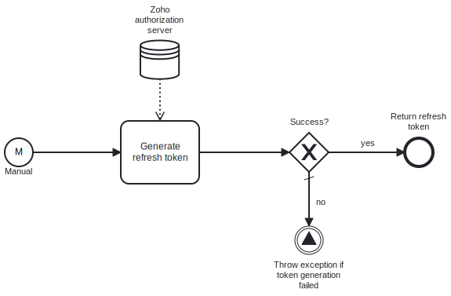

This template process exchanges a one-time-use grant token for a refresh token that can be used in other Zoho CRM templates.

# Prerequisites

This template assumes that the following prerequisites are in place:

- The grant token has been created in the [Zoho API console](https://api-console.zoho.com/) and has a scope that matches all required use cases.

# Implementation and Usage Notes

The purpose of this template is to exchange a one-time-use Zoho API grant token for an exchange token with unlimited uses, that can be used in other Zoho templates for API access, by passing it to them as a process variable.

The process variables include the client ID and secret for Zoho, the region-specific Zoho accounts domain, and the grant token to be used for the exchange.

# Error Handling

This template checks for errors after sending the token exchange request to the Zoho authorization server, and throws an exception if errors are encountered. If transient errors are expected, the task can be configured to retry the connection a given number of times before failing.
