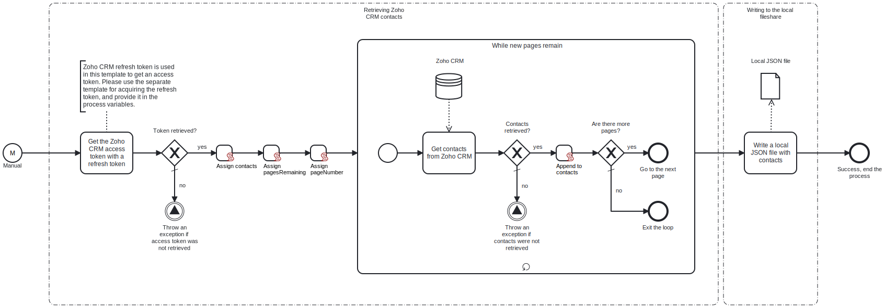

This template retrieves contact data from Zoho CRM and downloads it to a local fileshare as a single JSON file.

# Prerequisites

This template assumes that the following prerequisites are in place:

- Zoho CRM authorization token with the approppriate scope has been generated separately and provided in the process variable "ZohoAuthToken".
- The Frends agent has access to the local fileshare to which the resulting JSON file will be saved.
- The directory for the local JSON file exists.

# Implementation and Usage Notes

Zoho CRM API access token is retrieved via HTTP Request. The contacts are retrieved from Zoho CRM API with the API access token. Because the contacts are paginated, a while-loop is used to go through all the pages. By default, the API will provide 200 records per page.

After processing all the contact records, the contact data is written to a single JSON file as a JSON string. The full path where the file is saved, including the file name, is determined in the process variables. If a file with the same name exists in the specified path, the file will be overwritten. This behaviour can be changed in the task settings.

# Error Handling

If retrieving the access token or contacts from Zoho CRM fails, the template will throw an exception stating the error message and no file will be written. If an error occurs with writing the JSON file, e.g. because the directory can't be found, the task will throw an exception.

Transient errors are not handled. If they're expected, retries for connections to Zoho CRM can be enabled from the tasks.
