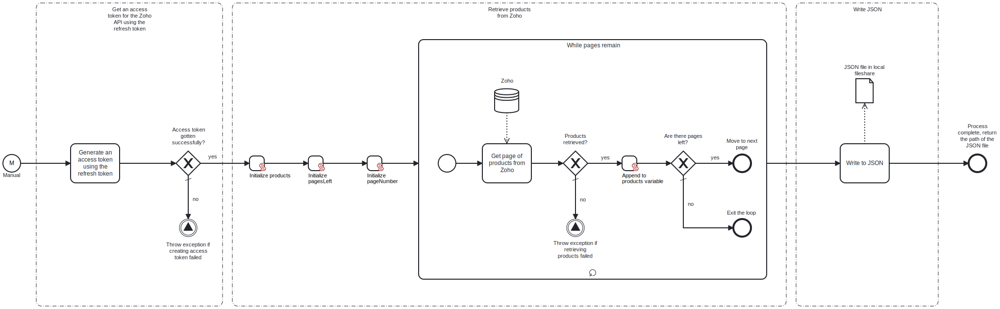

This template process retrieves the list of products from **Zoho CRM** and writes the information as a **JSON** file into the local fileshare.

Using this template, you can retrieve the list of products from Zoho and store it locally as JSON.

# Prerequisites

This template assumes that the following prerequisites are in place:

- You have a refresh token for the Zoho API. One can be created using the corresponding template.
- The client ID and client secret for Zoho are available.
- It is known which domain your Zoho instance is in, e.g., EU or America.
- The Frends agent has access to the folder into which the JSON file should be written.

# Implementation and Usage Notes

This template requires a refresh token for the Zoho API in order to work. The template will then use the refresh token to create the access token for accessing the API. The refresh token can be created using the "Zoho CRM - Exchange grant token for refresh token" template.

When writing the JSON file, if a file with the same name already exists, it will be overwritten. This behavior can be changed in the write tasks.

Zoho has different API domains for different geographical areas. For the template to work, requests need to be sent to the correct domain. This is ensured by passing the domain URLs to the template using process variables. The other process variables include the refresh token, the client ID and the client secret for Zoho, and the path to the JSON file to be written.

# Error Handling

This template checks for errors after each call to the Zoho API. If an error is encountered, the process will throw an exception.

If transient errors are expected, retries for the file write and Zoho connections can be configured in the corresponding tasks.