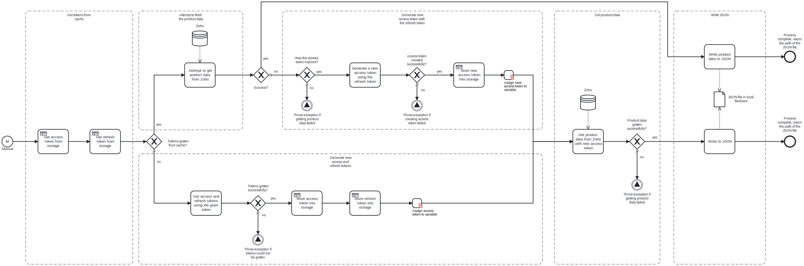

This template process retrieves the list of products from **Zoho** and writes the information as a **JSON** file into the local fileshare.

Using this template, you can retrieve the list of products from Zoho and store it locally as JSON.

# Prerequisites

This template assumes that the following prerequisites are in place:

- For the first time this template is used, a grant token has been created in the Zoho API console.
- The client ID and client secret for Zoho are available.
- It is known which domain your Zoho instance is in, e.g., EU or America.
- The Frends agent has access to the folder into which the JSON file should be written.

# Implementation and Usage Notes

The Zoho API implements authentication in a way where a single-use _grant token_ is used to generate an _access token_ for API access, and a _refresh token_ for creating new access tokens, since the access tokens have a lifetime of one hour. The grant token can only be created by hand in the [Zoho API console](https://api-console.zoho.com/).

This template requires the grant token in order to work correctly the first time it is run. The template will then use the grant token to create the access and refresh tokens for accessing the API, and store the refresh token into a cache for further use. During subsequent runs, the template uses the stored refresh token to create a new access token for accessing the API.

By default, this template stores the refresh token for 24 hours. If more than 24 hours have passed, the refresh token will no longer be available in the cache, which means the template will again require a grant token in order to be able to create a new refresh token. The lifetimes of the stored token can be changed by modifying the shared-state tasks in the template.

When writing the JSON file, if a file with the same name already exists, it will be overwritten. This behavior can be changed in the write tasks.

Zoho has different API domains for different geographical areas. For the template to work, requests need to be sent to the correct domain. This is ensured by passing the domain URLs to the template using process variables. The other process variables include the grant token, the client ID and the client secret for Zoho, and the path to the JSON file to be written.

# Error Handling

This template checks for errors after each call to the Zoho API. If an error is encountered, the process will throw an exception.

If transient errors are expected, retries for the file write and Zoho connections can be configured in the corresponding tasks.