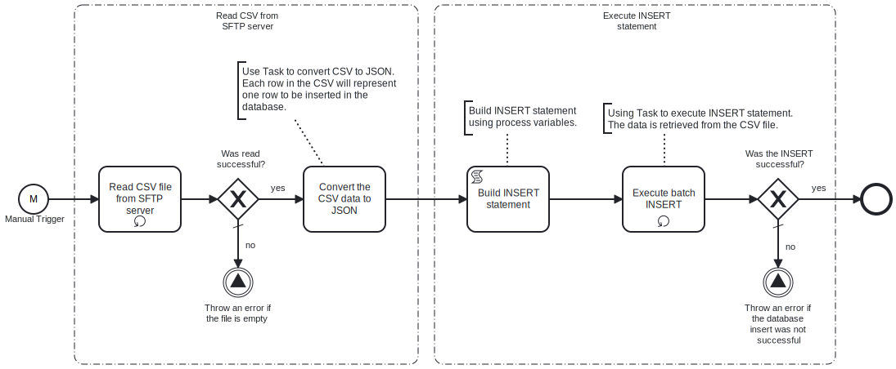

This process will read a **CSV file** which contains key-value pairs representing the data to be insert into the Microsoft SQL database from an **SFTP server**. 



# Prerequisites

This template assumes that the following prerequisites are in place:

- The SFTP server user should have the permissions to connect and access 
  the file that Frends needs to download.
- The CSV file containing the data must reside on the specified SFTP server.
- The Frends agent has access to database where the data will be inserted and the necessary permissions to perform the insert.

# Implementation and Usage Notes

This template only performs inserts into the database specified in the Process Variables.

The input CSV file should contain the data to be inserted. The CSV headers should correspond to database table columns.

**Example CSV data**

```
email;address1;address2;country;state;city;zipcode;phone;firstname;lastname;title
dave521@example.com;15440 River Drive;" #5100";USA;CA;Rivertown;123455;1234567895;Dave;Twenty-Five-One;Mr
dave522@example.com;15442 River Drive;" #5102";USA;CA;Rivertown;123452;1234567892;Dave;Twenty-Five-Two;Mr
```


# Error Handling

This template does not handle transient errors separately, however the connection
to the SFTP server and the atabase are retried three time before failing.

The template does not handle any SQL errors that may occur and will throw an error if those occur.
