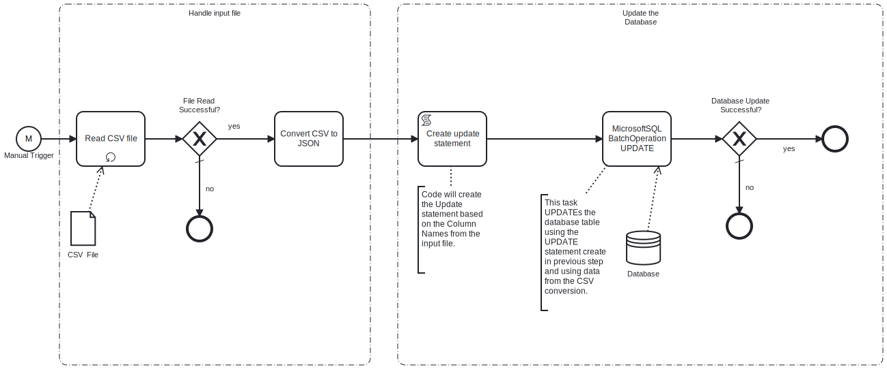

This process will read a **CSV file** which contains key-value pairs representing the data to be updated in the MicrosoftSQL database from an **SFTP server**. 

# Prerequisites

This template assumes that the following prerequisites are in place:

- The SFTP server user should have the permissions to connect and access 
  the files that Frends needs to download.
- The Frends agent has access to database where the data will be insert and the necessary permissions to perform the insert.

# Implementation and Usage Notes

This template only performs updates to a table in a MicrosoftSQL database specified in the Process Variables.
The input CSV file will contained the data to be inserted in key-value format, it must contain column names that match the column names in the table that is to be updated.
The Process Variable rowIdentifier must be set to the name of the table column that will uniquely indentify the row to be updated.

**Example CSV data**

email;address1;address2;state;phone;lastname;title

dave21@frends.com;1440 River Drive;" #100";CA;123456789;Twenty-One;Mr

dave51@frends.com;1990 River Drive;" #101";NH;123456789;Fifty-One;Mr

dave52@frends.com;1991 River Drive;" #101";NY;123456789;Fifty-Two;Master

dave53@frends.com;1992 River Drive;" #101";NY;123456789;Fifty-Three;Master

# Error Handling

This template does not handle transient errors separately, however the connection
to the SFTP server and Database are retried three time before failing.

The template does not handle any SQL errors that may occur, these should be referred to **SUPPORT**
