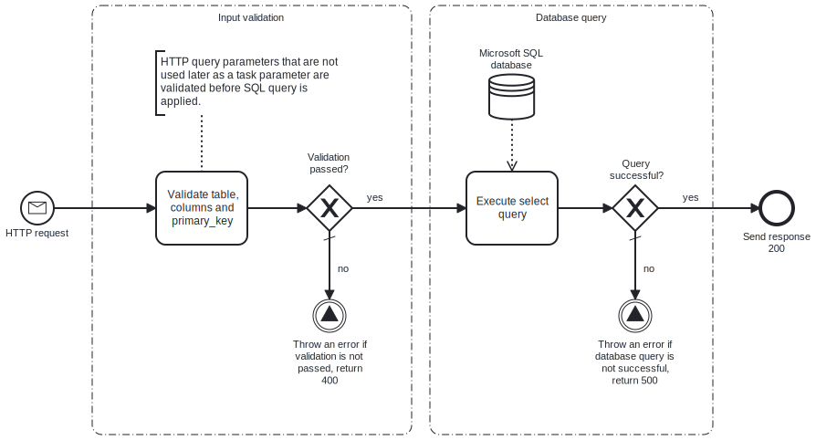

This template validates query parameters from an HTTP request and uses the parameters to execute a paginated search in the database.
Using this template, you can execute paginated searches in the Microsoft SQL database based on how many items you want per page.



# Prerequisites

This template assumes that the following prerequisites are in place:

- Microsoft SQL database and a table with data exist for performing the search.
- Microsoft SQL connection string is accessible and used with this template.
- The HTTP request should contain the values for the table, the columns, the page number and the primary key in the path:

```plaintext
yourfrendsagent.frendsapp.com/getDatabasePage?table=yourtable&columns=yourcolumns&pageNumber=pagenumberhere&sortBy=primarykey
```

# Implementation and Usage Notes

Before executing the database query, the values from the HTTP query are validated. Page number is not validated with the other values because it is used by Microsoft SQL task parameter and is validated by the task itself.
This template uses a Microsoft SQL SELECT-query to retrieve information from a specific page. In the search, the offset is calculated with the relation of process variable for items per page and the page number, which is passed as an HTTP query parameter.
Other Microsoft SQL queries than SELECT are not performed by this template.
Process variables include the desired number of items per page and the connection string for the Microsoft SQL database.

# Error Handling

Validation task and the Microsoft SQL query execution task are followed by an error check. If an error occurs, the process will throw an exception and an error message will be displayed.
If transient errors are expected, retry for Microsoft SQL connection can be enabled from the task. Transient errors are not handled.