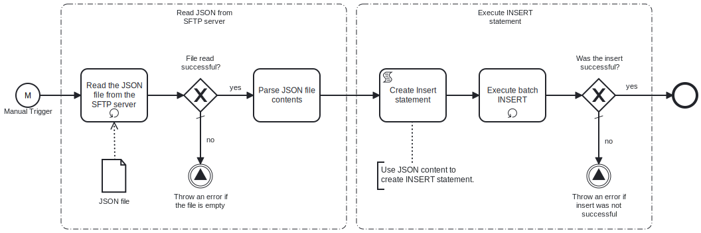

This Process will read a JSON file from the SFTP server and insert data from it into the Microsoft SQL database table.



# Prerequisites

This template assumes that the following prerequisites are in place:

- The SFTP server user should have the permissions to connect and access
  the files that Frends needs to download
- Frends agent has access to the Microsoft SQL Server database where the data will be inserted and the necessary permissions to perform the insert
- Table to which data will be insterted must be already configured
- JSON file contains an array of objects
- Each object represents one row in database table
- JSON object property names correspond to column names in the database table

# Implementation and Usage Notes

This template only performs INSERT queries into the database table specified in the Process Variables.

**Example JSON data**

```
[
	{
		"email": "dave121@example.com",
		"address1": "91441 River Drive",
		"address2": " #1901",
		"country": "USA",
		"state": "CA",
		"city": "Rivertown",
		"zipcode": "123451",
		"phone": "1234567891",
		"firstname": "Dave",
		"lastname": "Twenty-One",
		"title": "Mr"
	},
	{
		"email": "dave221@example.com",
		"address1": "91442 River Drive",
		"address2": " #1902",
		"country": "USA",
		"state": "CA",
		"city": "Rivertown",
		"zipcode": "123452",
		"phone": "1234567892",
		"firstname": "Dave221",
		"lastname": "Twenty-One",
		"title": "Mr"
	}
]
```

# Error Handling

This template does not handle transient errors separately, however the connection to the SFTP server and Microsoft SQL Server are retried three time before failing.

The template does not handle any SQL errors that may occur - these errors will be thrown as exceptions.
