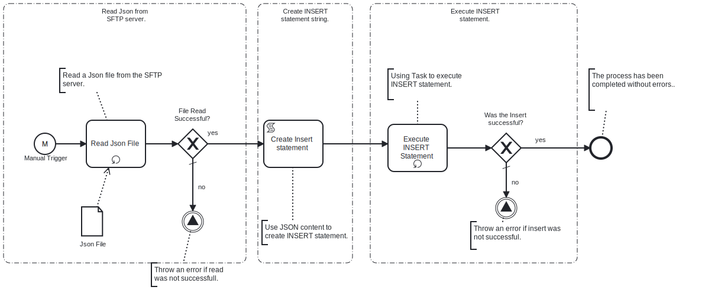

Process will get Json file from SFTP server and Insert data from it to the Microsoft SQL Server Database.



# Prerequisites

This template assumes that the following prerequisites are in place:

- The SFTP server user should have the permissions to connect and access
  the files that Frends needs to download.
- The Frends agent has access to the Microsoft SQL Server database where the data will be inserted and the necessary permissions to perform the insert.
- Table to which data will be insterted must be already configured
- JSON file contains array of objects with key-value pairs.
- Each object represents new row in database table
- Each key-value pair represents column in table (columns required by table must exist in Json object)

# Implementation and Usage Notes

This template only performs INSERTs into the database table specified in the Process Variables.

The input JSON file must contain the data to be inserted in key-value format, it can contain any column names from the MySQL table.

**Example JSON data**

```
[
	{
		"email": "dave121@example.com",
		"address1": "91441 River Drive",
		"address2": " #1901",
		"country": "USA",
		"state": "CA",
		"city": "Rivertown",
		"zipcode": "123451",
		"phone": "1234567891",
		"firstname": "Dave",
		"lastname": "Twenty-One",
		"title": "Mr"
	},
	{
		"email": "dave221@example.com",
		"address1": "91442 River Drive",
		"address2": " #1902",
		"country": "USA",
		"state": "CA",
		"city": "Rivertown",
		"zipcode": "123452",
		"phone": "1234567892",
		"firstname": "Dave221",
		"lastname": "Twenty-One",
		"title": "Mr"
	}
]
```

# Error Handling

This template does not handle transient errors separately, however the connection to the SFTP server and Microsoft SQL Server database are retried three time before failing.

The template does not handle any SQL errors that may occur - the errors will be thrown as exceptions.
