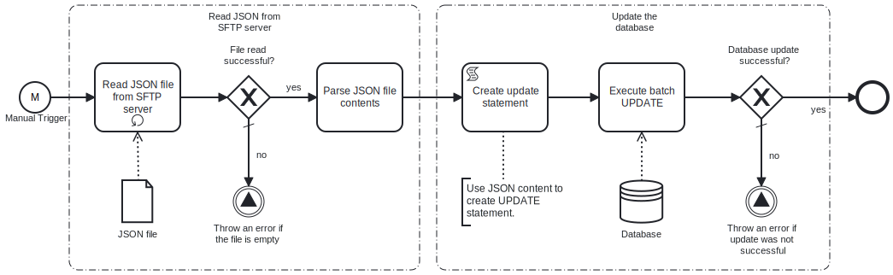

This process will read a **Json file**, which contains key-value pairs representing the data to update the specified table in the **MicrosoftSQL database**, from an **SFTP server**. 




# Prerequisites

This template assumes that the following prerequisites are in place:

- The **SFTP server** user should have the permissions to connect and access 
  the files that Frends needs to download.
- The Frends agent has access to **MicrosoftSQL database** where the data will be updated and the necessary permissions to perform the insert.

# Implementation and Usage Notes

This template only performs updates into the **MicrosoftSQL database** table specified in the Process Variables.
This process will read a **Json file**, which contains key-value pairs representing the data to update the specified table in the **MicrosoftSQL database**, from an **SFTP server**. 

**Example Json data**
```
[
	{
		"RateKey": "EURUSD",
		"Currency": "USD",
		"Rate": 1.05,
		"RateDate": "2024-03-20 12:12:04.000",
		"Where": "RateKey = 'EURUSD'"
	},
	{
		"RateKey": "EURGBP",
		"Currency": "GBP",
		"Rate": 1.05,
		"RateDate": "2024-03-20 12:12:04.000",
		"Where": "RateKey = 'EURGBP'"
	},
	{
		"RateKey": "EURDKK",
		"Currency": "DKK",
		"Rate": 1.05,
		"RateDate": "2024-03-20 12:12:04.000",
		"Where": "RateKey = 'EURDKK'"
	},
	{
		"RateKey": "EURJPY",
		"Currency": "JPY",
		"Rate": 1.05,
		"RateDate": "2024-03-20 12:12:04.000",
		"Where": "RateKey = 'EURJPY'"
	}
]
```

# Error Handling

This template does not handle transient errors separately, however the connection
to the **SFTP server** and **MicrosoftSQL database** are retried three time before failing.

The template does not handle any SQL errors that may occur - these will be handled as exceptions.
