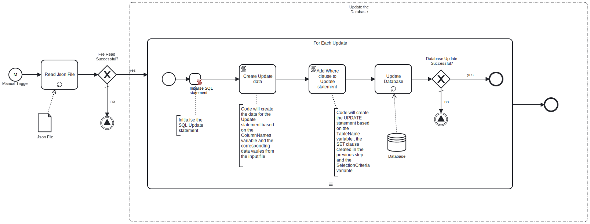

This process will read a **Json file**, which contains key-value pairs representing the data to update the specified table in the database, from an **SFTP server**. 

# Prerequisites

This template assumes that the following prerequisites are in place:

- The SFTP server user should have the permissions to connect and access 
  the files that Frends needs to download.
- The Frends agent has access to database where the data will be insert and the necessary permissions to perform the insert.

# Implementation and Usage Notes

This template only performs updates into the database specified in the Process Variables.
The input Json file will contain the data to be inserted in key-value format, it can contain any column names from the table that is to be updated.
One of the key-values pairs must be "**Where**" which will be the SQL WHERE clause. If the value is blank or null then the update will be applied to all rows of the table.
**Exampls Json data**
[
	{
		"RateKey": "EURUSD",
		"Currency": "USD",
		"Rate": 1.05,
		"RateDate": "2024-03-20 12:12:04.000",
		"Where": "RateKey = 'EURUSD'"
	},
	{
		"RateKey": "EURGBP",
		"Currency": "GBP",
		"Rate": 1.05,
		"RateDate": "2024-03-20 12:12:04.000",
		"Where": "RateKey = 'EURGBP'"
	},
	{
		"RateKey": "EURDKK",
		"Currency": "DKK",
		"Rate": 1.05,
		"RateDate": "2024-03-20 12:12:04.000",
		"Where": "RateKey = 'EURDKK'"
	},
	{
		"RateKey": "EURJPY",
		"Currency": "JPY",
		"Rate": 1.05,
		"RateDate": "2024-03-20 12:12:04.000",
		"Where": "RateKey = 'EURJPY'"
	}
]
# Error Handling

This template does not handle transient errors separately, however the connection
to the SFTP server and Database are retried three time before failing.

The template does not handle any SQL errors that may occur, these should be referred to **SUPPORT**
