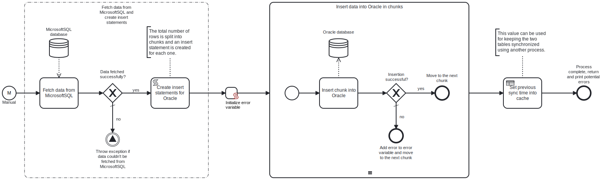

This template process loads data from a table in a **MicrosoftSQL** database into a table in an **Oracle** database in chunks. This template process is meant to be used in conjunction with the "MicrosoftSQL to Oracle - Changes sync" template, which keeps the two tables synchronized after the initial load.



# Prerequisites

This template assumes that the following prerequisites are in place:

- A destination table in the Oracle database already exists, and it has the same column names as the source table in MicrosoftSQL.
- Both the source table on MicrosoftSQL and the destination table in Oracle have a column for storing the timestamp of when a row has been inserted or updated.
- The MicrosoftSQL user has permissions to read data from the specified table.
- The Oracle user has permissions to write data into the specified table.

# Implementation and Usage Notes

This template process queries data from a table in a **MicrosoftSQL** database, and inserts the rows in user-specified chunks into a table in an **Oracle** database. To do this, the process first fetches the data, and then forms a list of INSERT statements based on the defined chunk size. Afterwards, the INSERT statements are executed one at a time.

Because this template process is intended to be used in conjunction with the "MicrosoftSQL to Oracle - Changes sync" template, each inserted row will contain a UTC timestamp of the time when it was inserted. To the same end, this template process also uses a shared-state task to store a timestamp of when it was run into a cache. The "MicrosoftSQL to Oracle - Changes sync" process can then use this timestamp to determine which rows should be updated. This is also the reason why the source table in MicrosoftSQL should have a timestamp column as well, it is needed for the synchronization process.

This template does not update existing rows.

The process variables include:
- Connection strings and table names for both databases, and in the case of Oracle, the schema name as well.
- The names of the columns whose data should be loaded.
- The name of the column that the timestamps should be stored into.
- The desired chunk size.

**Example source table structure in MicrosoftSQL**

```sql
CREATE TABLE CONTACTS(
    id NUMBER NOT NULL PRIMARY KEY,
    email VARCHAR2(25),
    firstname VARCHAR2(20),
    lastname VARCHAR2(20),
    phone VARCHAR2(15),
    updated_time DATETIME
);
```

**Example destination table structure in Oracle**

```sql
CREATE TABLE MY_SCHEMA.CONTACTS(
    id NUMBER NOT NULL PRIMARY KEY,
    email VARCHAR2(25),
    firstname VARCHAR2(20),
    lastname VARCHAR2(20),
    phone VARCHAR2(15),
    updated_time TIMESTAMP
);
```

In this example case, the process variables would be:
- MicrosoftSqlTableName: CONTACTS
- ColumnNames: id, email, firstname, lastname, phone
- OracleTimestampColumn: updated_time
- OracleSchema: MY_SCHEMA
- OracleTableName: CONTACTS

# Error Handling

There is an error check after each task. If querying the MicrosoftSQL database fails, the process will throw an exception and stop. If inserting a chunk, i.e., executing an insert statement fails, the process will move on to the next chunk and append an error message into a variable that will be printed at the end of the execution.

This template does not handle transient errors separately. If such errors are expected, the tasks can be configured to retry execution on failure.