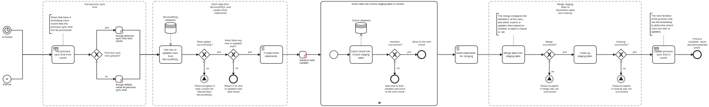

This template process fetches new or updated rows from a table in a **MicrosoftSQL** database and inserts or updates the rows into a table in an **Oracle** database in chunks. This template process is meant to be used in conjunction with the "MicrosoftSQL to Oracle - Batch load" template, which can be used initially to load data from the MicrosoftSQL table to the Oracle table.



# Prerequisites

This template assumes that the following prerequisites are in place:

- A staging table in the Oracle database already exists, and it has the same column names as the source table in MicrosoftSQL.
- The destination table in the Oracle database already exists, and it has the same column names as the source table in MicrosoftSQL and the staging table.
- Both the source table in MicrosoftSQL and the tables in Oracle have a column for storing the timestamp of when a row has been inserted or updated.
- The tables have a column whose values can be used to uniquely identify rows, and the name of this column is the same in all tables.
- The MicrosoftSQL user has permissions to read data from the specified table.
- The Oracle user has permissions to write data into the specified table.

# Implementation and Usage Notes

This template process queries new or updated rows from a table in a **MicrosoftSQL** database, and either inserts or updates the data into a table in an **Oracle** database. To determine which rows are new or updated, the process compares the rows' timestamp data (specified in a column, as described in the prerequisites) to either the timestamp of the previous synchronization, or a default value. If the timestamp on a row is more recent than the timestamp or the time of the previous sync, the row in question will be processed.

Once the new or updated rows have been fetched, the process builds a series of INSERT statements based on the user-specified chunk size. Afterwards, the INSERT statements are executed one at a time, inserting the data into a staging table in the Oracle database. After the insertions the staging table is merged into the destination table - this is where it is determined if each row should be inserted or updated by comparing the values of the identifier column of the staging table to the destination table. If a match is found between the staging and destination tables, the row in the destination table will be updated with the values from the staging table. If not, the row will be inserted. Finally, the staging table is cleared of data to prepare for the next synchronization and the previous synchronization timestamp is updated in the cache.

By default, this process is run once per hour, but this schedule can be changed in the schedule trigger of the process. Similarly, the default lifetime of the previous synchronization time entry in the cache (24 hours), and the default value assigned for the previous synchronization time if no value is found in the cache (current time minus 3 hours) can be changed as needed.

All handling of the timestamps is done in UTC time, using the format yyyy-MM-dd HH:mm:ss.

The process variables include:
- Connection strings and table names for both databases, and in the case of Oracle, the schema name as well.
- The names of the columns whose data should be loaded.
- The name of the column that the timestamps are stored in.
- The name of the column to be used for uniquely identifying each row.
- The desired chunk size.

**Example source table structure in MicrosoftSQL**

```sql
CREATE TABLE CONTACTS(
    id NUMBER NOT NULL PRIMARY KEY,
    email VARCHAR2(25),
    firstname VARCHAR2(20),
    lastname VARCHAR2(20),
    phone VARCHAR2(15),
    updated_time DATETIME
);
```

**Example staging and destination table structure in Oracle**

```sql
CREATE TABLE MY_SCHEMA.CONTACTS_STAGING(
    id NUMBER NOT NULL PRIMARY KEY,
    email VARCHAR2(25),
    firstname VARCHAR2(20),
    lastname VARCHAR2(20),
    phone VARCHAR2(15),
    updated_time TIMESTAMP
);

CREATE TABLE MY_SCHEMA.CONTACTS(
    id NUMBER NOT NULL PRIMARY KEY,
    email VARCHAR2(25),
    firstname VARCHAR2(20),
    lastname VARCHAR2(20),
    phone VARCHAR2(15),
    updated_time TIMESTAMP
);
```

In this example case, the process variables would be:
- MicrosoftSqlTableName: CONTACTS
- ColumnNames: id, email, firstname, lastname, phone
- IdentifierColumn: id
- TimestampColumn: updated_time
- OracleSchema: MY_SCHEMA
- OracleStagingTableName: CONTACTS_STAGING
- OracleTableName: CONTACTS

# Error Handling

There is an error check after each task. If querying the MicrosoftSQL database fails, the process will throw an exception and stop. If inserting a chunk, i.e., executing an insert statement fails, the process will move on to the next chunk and append an error message into a variable that will be printed at the end of the execution. If merging the staging table into the destination table, or cleaning up the staging table fails, the process will throw an exception and stop.

This template does not handle transient errors separately. If such errors are expected, the tasks can be configured to retry execution on failure.