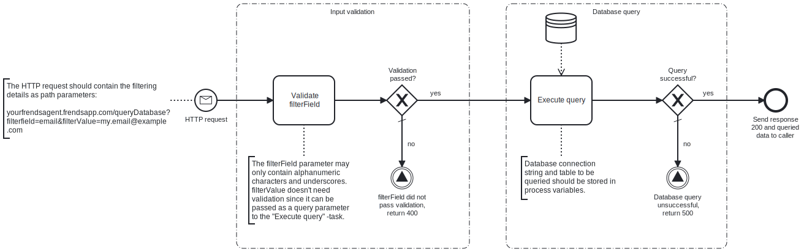

This template process receives an **HTTP request**, queries data from a **MicrosoftSQL database** based on parameters given in the HTTP request, and returns the queried data to the caller as **JSON**. 



# Prerequisites

This template assumes that the following prerequisites are in place:

- The **MicrosoftSQL database** user has permissions to read data from the specified table.


# Implementation and Usage Notes

This template process returns **JSON** data based on the execution of an SQL SELECT query formed using parameters given in the **HTTP request**.
The HTTP request query parameters specify a column and value to be filtered, for example "email" and "my.email@domain.com". The first parameter defines the column, and the second the value. The process will then return all matching rows as **JSON**.

The column name given in the HTTP request parameter is validated by only allowing alphanumeric characters and underscores. This is because column names cannot be passed as query parameters to the SQL query to be executed, and thus aren't automatically validated.
If the validation is not passed, the template will return a 400 status code with an appropriate error message to the caller.

The Process Variable ConnectionString determines the **Microsoft SQL** database to be connected to, and the Process Variable TableName specifies the table to be queried.

By default, the HTTP trigger is set to use [API key](https://docs.frends.com/en/articles/2206706-api-keys) authentication.

If this template process is to be used as a part of a larger API, the trigger can be changed into an [API trigger](https://docs.frends.com/en/articles/2206741-api-trigger).

**Example HTTP request URL**

`https://myfrendsagent.frendsapp.com/queryDatabase?filterfield=email&filterValue=my.email@example.com`

**Example return value**
```
{
    "data": [
        {
            "id": 1,
            "name": "my-name",
            "email": "my.email@example.com"
        },
        {
            "id": 2,
            "name": "other-name",
            "email": "my.email@example.com"
        }
    ]
}
```

If no rows match the given parameters, `data` will be an empty list `[]`.
# Error Handling

This template does not handle transient errors separately.

The template does not handle any SQL errors that may occur - the errors will be thrown as exceptions and return 500.
