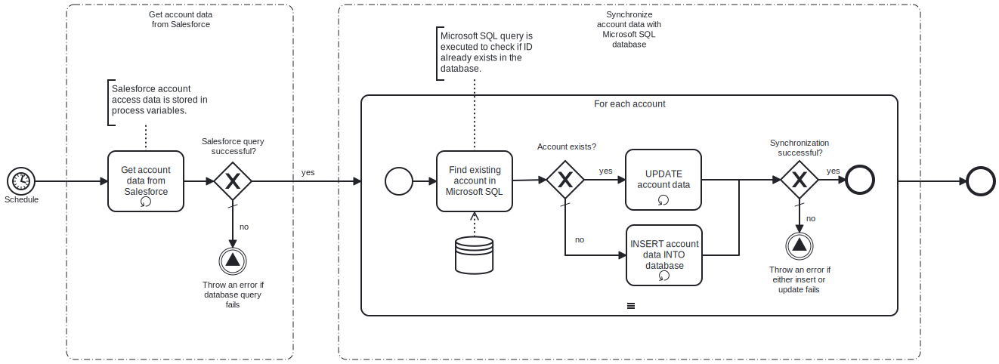

This template synchronizes Salesforce account information with Microsoft SQL database table.
Using this template, you can insert and update Salesforce account information to Microsoft SQL database on a schedule.

# Prerequisites

This template assumes that the following prerequisites are in place:

- The Salesforce user should have access to their client id, client secret and security token.
- The Microsoft SQL user has permissions to write data in the table specified in the query.

# Implementation and Usage Notes

This template only uses SQL queries for update and insert. Other queries are not supported in this template.
Process variables include fields for Salesforce credentials, Microsoft SQL table name and connection string.

# Error Handling

Connection to Salesforce and both update and insert queries are retried three time before failing.
Any other error is not handled by the process.
