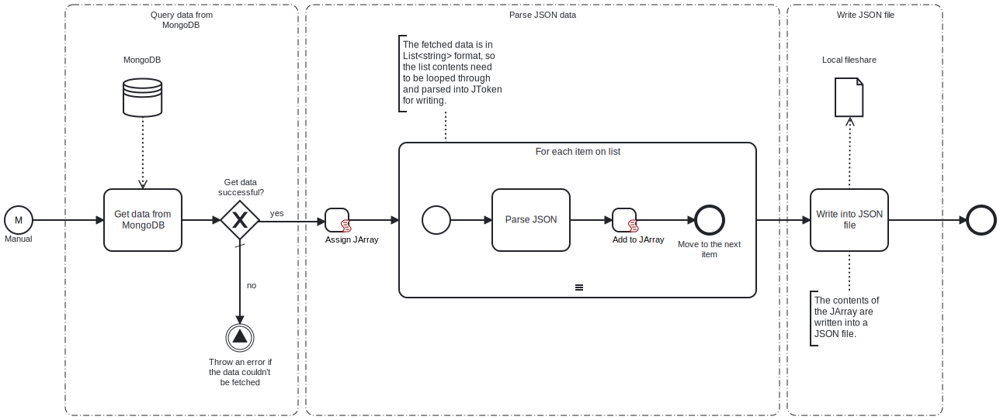

This template retrieves data from a MongoDB collection and exports it to a local fileshare as a single JSON file.

# Prerequisites

This template assumes that the following prerequisites are in place:

- The MongoDB user has access to the database with the necessary permissions to query data.
- The Frends agent has access to the local fileshare to which the resulting JSON file will be saved.

# Implementation and Usage Notes

This template queries data from the specified collection in a MongoDB database. To customize the results, the query filters can be adjusted in the MongoDB task's filter section. The default filter retrieves all documents from the collection. 

The fetched data is in a `List<string>` format and must be converted before writing to a file. This is handled by a foreach loop, which parses each item into JSON and stores them in a JArray for writing.

The full path of the created file, including the file name, is determined within the process variables. If a file with the same name already exists, it will be overwritten. This can be changed in the write task's settings.

# Error Handling

If the MongoDB query fails, the process throws an exception. The template does not handle transient errors separately.
