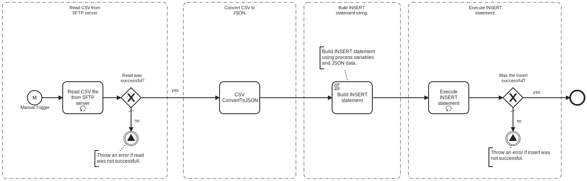

This process will read a **CSV file** which contains key-value pairs representing the data to be insert into the MySQL database from an **SFTP server**. 

# Prerequisites

This template assumes that the following prerequisites are in place:

- The SFTP server user should have the permissions to connect and access 
  the files that Frends needs to download.
- The Frends agent has access to database where the data will be insert and the necessary permissions to perform the insert.

# Implementation and Usage Notes

This template only performs inserts into the database specified in the Process Variables.
The input CSV file will contained the data to be inserted in key-value format and must only contain data for one record.
**Exampls CSV data**
name;age;email
Emma Brown;28;emma.brown@example.com

# Error Handling

This template does not handle transient errors separately, however the connection
to the SFTP server and Database are retried three time before failing.

The template does not handle any SQL errors that may occur.
