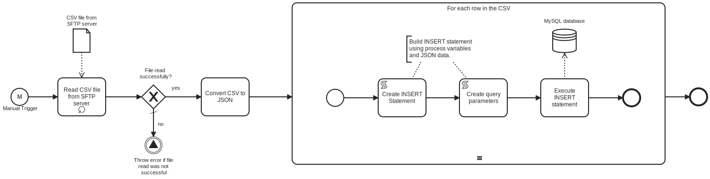

This process will connect to an **SFTP server** and read a **CSV** file, which contains  the data to INSERT into the specified table in the **MySQL database**.



# Prerequisites

This template assumes that the following prerequisites are in place:

- The **SFTP server** user should have the permissions to connect and access 
  the files that Frends needs to download.
- The Frends agent has access to the **MySQL database** where the data will be inserted and the necessary permissions to perform the insert.
- The **CSV** column names are the same as the column names in the **MySQL database** table.

# Implementation and Usage Notes

This template only performs INSERTs into the **MySQL database** table specified in the Process Variables.

The input **CSV** file must contain data corresponding to the table structure in the MySQL database. The CSV headers should match the table column names.

**Example CSV data**

```
email;address1;address2;country;state;city;zipcode;phone;firstname;lastname;title
john@example.org;15440 River Drive;" #5100";USA;CA;Rivertown;123455;1234567895;John;Twenty-Five-One;Mr
john@example.org;16440 River Drive;" #6100";USA;CA;Rivertown;123456;1234567896;John;Twenty-Six-One;Mr
john@example.org;15440 River Drive;" #5100";USA;CA;Rivertown;123455;1234567895;John;Twenty-Five-One;Mr
john@example.org;16440 River Drive;" #6100";USA;CA;Rivertown;123456;1234567896;John;Twenty-Six-One;Mr
john@example.org;15440 River Drive;" #5100";USA;CA;Rivertown;123455;1234567895;John;Twenty-Five-One;Mr
john@example.org;16440 River Drive;" #6100";USA;CA;Rivertown;123456;1234567896;John;Twenty-Six-One;Mr
john@example.org;15440 River Drive;" #5100";USA;CA;Rivertown;123455;1234567895;John;Twenty-Five-One;Mr
john@example.org;16440 River Drive;" #6100";USA;CA;Rivertown;123456;1234567896;John;Twenty-Six-One;Mr
```

# Error Handling

This template does not handle transient errors separately.

The template does not handle any SQL errors that may occur - the errors will be thrown as exceptions.
