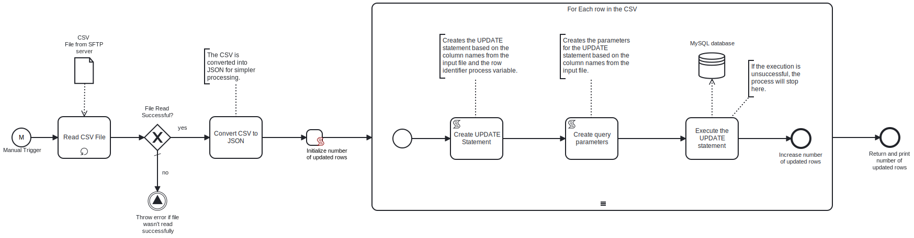

This process reads a **CSV file** from an **SFTP server** which contains data to be updated in an **MySQL database**. It then forms an UPDATE statement based on the data and executes it. 




# Prerequisites

This template assumes that the following prerequisites are in place:

- The **SFTP server** user should have the permissions to connect and access 
  the files that Frends needs to download.
- The MySQL user has access to the **MySQL database** where the data will be updated and the necessary permissions to perform the update.
- The column names in the CSV file correspond to the column names in the **MySQL** table to be updated.

# Implementation and Usage Notes

This template performs updates to a table in a **MySQL database** specified in the Process Variables. The column names in the MySQL database must correspond to the ones in the CSV file.
The Process Variable `RowIdentifier` must be set to the name of the table column that will uniquely indentify the row to be updated. For example, if the RowIdentifier is email, the records, whose email matches the email of each row in the CSV, will be updated.

**Example CSV data**
```csv
email;address1;address2;state;phone;lastname;title;

example1@example.com;1440 River Drive;#100;CA;123456789;Example1;Mr;

example2@example.com;1990 River Drive;#101;NH;123456789;Example2;Mr;

example3@example.com;1991 River Drive;#101;NY;123456789;Example3;Ms;

example4@example.com;1992 River Drive;#101;NY;123456789;Example4;Mrs;
```


# Error Handling

This template does not handle transient errors separately, however the connection
to the **SFTP server** is retried three times before failing.

The template does not handle any SQL errors that may occur - the process will throw an exception in the case of an SQL error.
