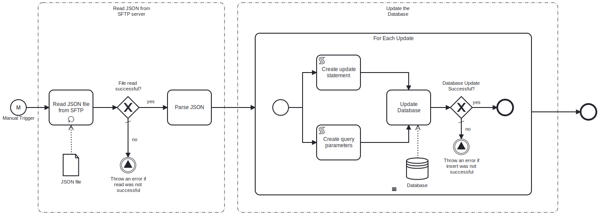

This process will read a **Json** file, which contains key-value pairs representing the data to update the specified table in the **MySQL database**, from an **SFTP server**. 




# Prerequisites

This template assumes that the following prerequisites are in place:

- The **SFTP server** user should have the permissions to connect and access 
  the files that **Frends** needs to download.
- The **Frends** agent has access to **MySQL database** where the data will be insert and the necessary permissions to perform the insert.

# Implementation and Usage Notes

This template only performs updates into the **MySQL database** specified in the Process Variables.
The input **Json** file will contain the data to be updated in key-value format and must not contain nested elements.
It can contain any column names from the table that is to be updated.


**Example Json data**
```
[
	{
		"email": "dave121@example.com",
		"zipcode": "123451",
		"firstname": "Fred",
		"title": "Mr"
	},
	{
		"phone": "91234567891",
		"firstname": "Dave",
		"lastname": "Twenty-One",
		"title": "Mr"
	},
	{
		"address2": " #1909",
		"country": "CAN",
		"state": "CL"
		....
		....
]
```

# Error Handling

This template does not handle transient errors separately, however the connection
to the **SFTP server** and **MySQL database** are retried three time before failing.

The template does not handle any SQL errors that may occur - these will be handled as exceptions.
