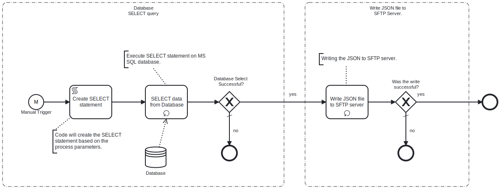

This process will create a **MySQL database** SELECT statement, execute the statement on the specified database and then write the results to an **SFTP server** in a **Json** file.

# Prerequisites

This template assumes that the following prerequisites are in place:

- The **Frends** agent has access to the **MySQL database** where the data will be inserted and the necessary permissions to perform the insert.
- The **SFTP server** user should have the permissions to connect and access 
  the files that **Frends** needs to download.

# Implementation and Usage Notes

This template only performs SELECTs from the **MySQL database** table specified in the Process Variables.

The SELECT statement is created using Process Variables
- ColumnNames ( a comma seperated list of the required columns, if all columns are required you can use *)
- SelectionCriteria ( column name and value to match on).

The output **Json** file will be written to the **SFTP server** specified.

# Error Handling

This template does not handle transient errors separately, however the connection to the **SFTP server** and **MySQL database** are retried three time before failing.

The template does not handle any SQL errors that may occur - the errors will be thrown as exceptions.