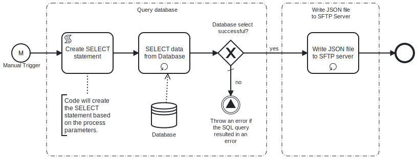

This template generates **JSON** data from **MySQL database** server. 
Using this template, you can fetch data from **MySQL database** server,  transform it into **JSON** file which will be saved on **SFTP server**.



# Prerequisites

This template assumes that the following prerequisites are in place:

- The **MySQL database** user has permissions to read data from the tables specified in the query.
- The **SFTP server** user should have the permissions to connect and write the files that Frends needs to upload.

# Implementation and Usage Notes

This template creates a new **CSV** file based on the data from the SQL query.

The variable SelectionCriteria provides the possibility to add conditions to the SELECT statement. This variable can be left empty.

If the file already exists on the **SFTP server**, it will be overwritten.

**Example JSON data**
```
[
	{
		"email": "john@example.org",
		"firstname": "John",
		"lastname": "Smith",
		"title": "Mr"
	},
	{
		"email": "jane@example.org",
		"firstname": "Jane",
		"lastname": "Doe",
		"title": "Ms"
	}
]
```

# Error Handling

This template does not handle transient errors separately, however the connection to the **SFTP server** and **MySQL database** are retried three time before failing.

The template does not handle any SQL errors that may occur - the errors will be thrown as exceptions.