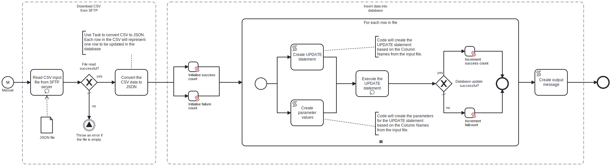

This process will connect to an SFTP server and read a CSV file, which contains  the data to INSERT into the specified table in the Oracle database.



# Prerequisites

This template assumes that the following prerequisites are in place:

- The SFTP server user should have the permissions to connect and access 
  the files that Frends needs to download.
- The Frends agent has access to the Oracle database where the data will be inserted and the necessary permissions to perform the insert.
- The CSV column names are the same as the column names in the Oracle database table.

# Implementation and Usage Notes

This template only performs INSERTs into the Oracle database table specified in the Process Variables.

The input CSV file must contain the data to be inserted can contain any column names from the Oracle database table.

**Example CSV data**

```
email;address1;address2;state;phone;lastname;title;Where
dave21@frends.com;1440 River Drive;" #100";CA;123456789;Twenty-One;Mr;address2 = ' #104'
dave51@frends.com;1990 River Drive;" #101";NH;123456789;Fifty-One;Mr;address2 = ' #107'
dave52@frends.com;1991 River Drive;" #101";NY;123456789;Fifty-Two;Master;phone = '563888888'
dave53@frends.com;1992 River Drive;" #101";NY;123456789;Fifty-Three;Master;phone = '444444444'
```

# Error Handling

This template does not handle transient errors separately, however the connection to the SFTP server and MySQL database are retried three time before failing.

The template does not handle any SQL errors that may occur - the errors will be thrown as exceptions.
