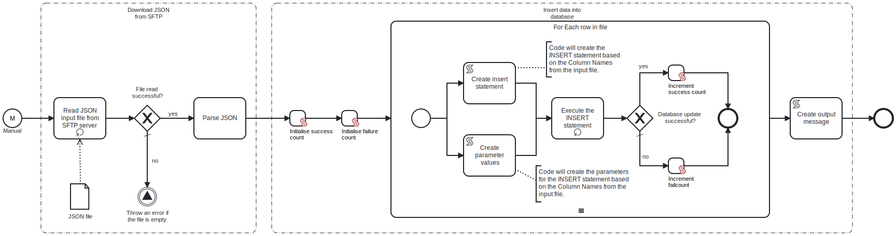

This process will connect to an **SFTP server** and read a **JSON** file, which contains  the data to INSERT into the specified table in the **Oracle database**.



# Prerequisites

This template assumes that the following prerequisites are in place:

- The **SFTP server** user should have the permissions to connect and access 
  the files that **Frends** needs to download.
- The **Frends** agent has access to the **Oracle database** where the data will be inserted and the necessary permissions to perform the insert.
- The **JSON** column names are the same as the column names in the **Oracle database** table.

# Implementation and Usage Notes

This template only performs INSERTs into the **Oracle database** table specified in the Process Variables.

The input **JSON** file will contain the data to be updated in key-value format and must not contain nested elements.
It can contain any column names from the table that is to be updated.

**Example JSON data**

```
[
	{
		"email": "dave121@example.org",
		"address1": "91441 River Drive",
		"address2": " #1901",
		"country": "USA",
		"state": "CA",
		"city": "Rivertown",
		"zipcode": "123451",
		"phone": "1234567891",
		"firstname": "Dave",
		"lastname": "Twenty-One",
		"title": "Mr"
	},
	{
		"email": "dave221@example.org",
		"address1": "91442 River Drive",
		"address2": " #1900",
		"country": "USA",
		"state": "CA",
		"city": "Rivertown",
		"zipcode": "123452",
		"phone": "1234567892",
		"firstname": "Dave",
		"lastname": "Twenty-two",
		"title": "Mr"
	},
	{
		"email": "dave123@example.org",
		"address1": "91443 River Drive",
		"address2": " #1903",
	...
	...
	...
```

# Error Handling

This template does not handle transient errors separately, however the connection to the **SFTP server** and **Oracle database** are retried three time before failing.

The template does not handle any SQL errors that may occur - the errors will be thrown as exceptions.
