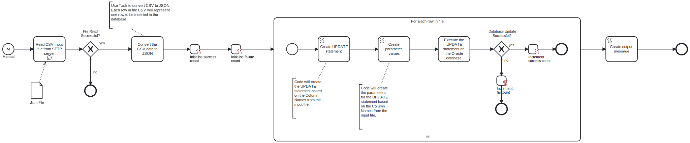

This process will connect to an SFTP server and read a JSON file, which contains the data to UPDATE in the specified table in the Oracle database.



# Prerequisites

This template assumes that the following prerequisites are in place:

- The SFTP server user should have the permissions to connect and access 
  the files that Frends needs to download.
- The Frends agent has access to the Oracle database where the data will be updated and the necessary permissions to perform the update.
- The JSON column names are the same as the column names in the Oracle database table.

# Implementation and Usage Notes

This template only performs UPDATEs into the Oracle database table specified in the Process Variables.

The input Json file will contain the data to be updated in key-value format and must not contain nested elements.
It can contain any column names from the table that is to be updated.

**Example JSON data**

```
[
	{
		"email": "dave121@frends.com",
		"phone": "1234567820",
		"firstname": "Fred",
		"title": "Mr"
	},
	{
		"email": "dave123@frends.com",
		"phone": "91234567894",
		"firstname": "John",
		"title": "Mr"

	},
	{
		"email": "dave221@frends.com",
		"phone": "91234567898",
		"firstname": "Bill",
		"title": "Mr"

	},
	{
		"email": "dave224@frends.com",
		"phone": "912345679",
		"firstname": "OLGA",
		"title": "Mr"

	}
]
```

# Error Handling

This template does not handle transient errors separately, however the connection to the SFTP server and MySQL database are retried three time before failing.

The template does not handle any SQL errors that may occur - the errors will be thrown as exceptions.
