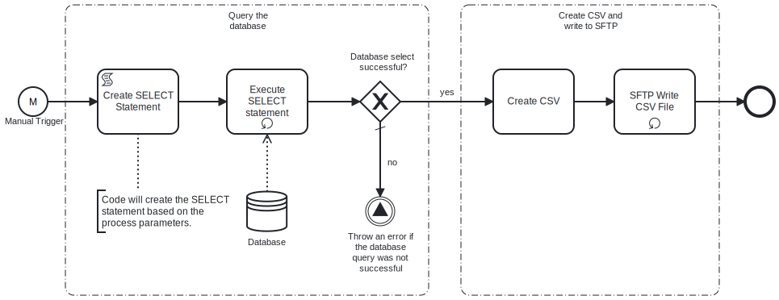

This template generates CSV data from Oracle database Server. 
Using this template, you can create a CSV file by fetching data from Oracle database Server, and then transform it into CSV file which will be saved on SFTP server.



# Prerequisites

This template assumes that the following prerequisites are in place:

- The Oracle database user has permissions to read data from the tables specified in the query.
- The SFTP server user should have the permissions to connect and write the files that Frends needs to upload.


# Implementation and Usage Notes

This template creates a new CSV file based on the data from the SQL query. 
The variable SelectionCriteria provides the possibility to add conditions to the SELECT statement.
In case of already existing file in SFTP server path, old file will be overwritten.

**Example CSV data**

```
email;address1;address2;country;state;city;zipcode;phone;firstname;lastname;title
dave1021@frends.com;15440 River Drive;" #5100";USA;CA;Rivertown;123455;1234567895;Dave;Twenty-Five-One;Mr
dave10621@frends.com;16440 River Drive;" #6100";USA;CA;Rivertown;123456;1234567896;Dave;Twenty-Six-One;Mr
dave10521@frends.com;15440 River Drive;" #5100";USA;CA;Rivertown;123455;1234567895;Dave;Twenty-Five-One;Mr
dave10621@frends.com;16440 River Drive;" #6100";USA;CA;Rivertown;123456;1234567896;Dave;Twenty-Six-One;Mr
dave10521@frends.com;15440 River Drive;" #5100";USA;CA;Rivertown;123455;1234567895;Dave;Twenty-Five-One;Mr
dave10621@frends.com;16440 River Drive;" #6100";USA;CA;Rivertown;123456;1234567896;Dave;Twenty-Six-One;Mr
```

# Error Handling

This template does not handle transient errors separately, however the connection to the SFTP server and Oracle database are retried three time before failing.

The template does not handle any SQL errors that may occur - the errors will be thrown as exceptions.
