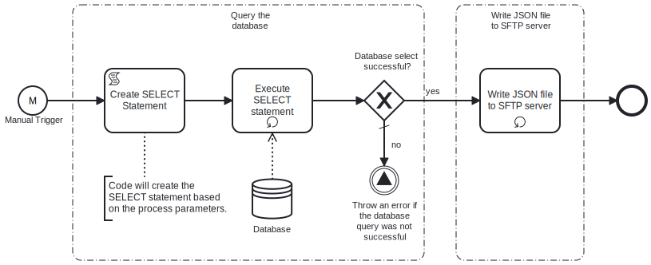

This template generates a **Json data** file from an **Oracle database** **SELECT** statement. 
Using this template, you can create a **Json** file by fetching data from an **Oracle database** Server, and then transform it into **Json** file which will be saved on **SFTP server**.



# Prerequisites

This template assumes that the following prerequisites are in place:

- The **Oracle database** user has permissions to read data from the tables specified in the query.
- The **SFTP server** user should have the permissions to connect and write the files that Frends needs to upload.


# Implementation and Usage Notes

This template creates a new **Json** file based on the data from the SQL query. 
The variable SelectionCriteria provides the possibility to add conditions to the **SELECT** statement.
In case of already existing file in the **SFTP server** path, old file will be overwritten.

**Example JSON data**

```
[
	{
		"email": "dave121@frends.com",
		"address1": "91441 River Drive",
		"address2": " #1901",
		"country": "USA",
		"state": "CA",
		"city": "Rivertown",
		"zipcode": "123451",
		"phone": "1234567891",
		"firstname": "Dave",
		"lastname": "Twenty-One",
		"title": "Mr"
	},
	{
		"email": "dave221@frends.com",
		"address1": "91442 River Drive",
		"address2": " #1900",
		"country": "USA",
		"state": "CA",
		"city": "Rivertown",
		"zipcode": "123452",
		"phone": "1234567892",
		"firstname": "Dave",
		"lastname": "Twenty-two",
		"title": "Mr"
	},
	{
		"email": "dave123@frends.com",
		"address1": "91443 River Drive",
		"address2": " #1903",
	...
	...
	...
```

# Error Handling

This template does not handle transient errors separately, however the connection to the SFTP server and Oracle database are retried three time before failing.

The template does not handle any SQL errors that may occur - the errors will be thrown as exceptions.
