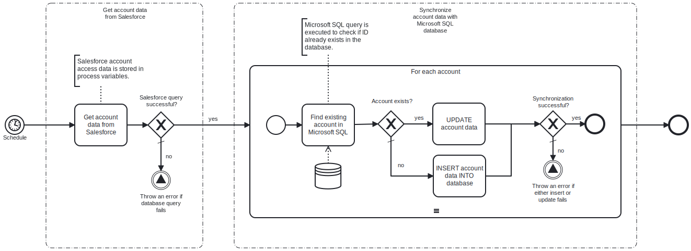

This template synchronizes Salesforce account information with Microsoft SQL database table.
Using this template, you can insert and update Salesforce account information to Microsoft SQL database on a schedule.

# Prerequisites

This template assumes that the following prerequisites are in place:

- The Salesforce user should have access to client ID, secret and security token.
- The Microsoft SQL user has permissions to write data in the table specified in the query.

# Implementation and Usage Notes

This template uses SQL queries for update and insert. Other queries are not implemented in this template, e.g. for handling deleted or deactivated accounts.
Process variables include fields for Salesforce credentials, Microsoft SQL table name and connection string.

# Error Handling

Error handling is not implemented in this template.
However, if transient errors are expected, retries for Salesforce connection and database queries can be enabled from the tasks.