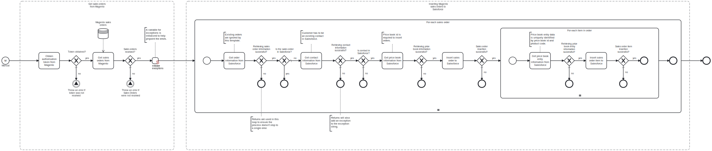

This template exports sales orders from Magento and imports them to Salesforce.
Using this template, you can insert sales order and order products data from Magento to Salesforce.

# Prerequisites

This template assumes that the following prerequisites are in place:

- Salesforce user exists for performing the synchronization.
- Magento customer has been added as a contact in Salesforce with account information.
- Because products are uniquely identified with product codes, products from Magento should be added to Salesforce using the appropriate template before using this template.

# Implementation and Usage Notes

This template uses Salesforce queries to get information about orders, contacts and price books. Orders created by this template are matched by their reference number to avoid duplicates. Contact is matched with the customer by the customer email address. Price book is identified by name, and the entry in the price book is matched by both price book id and product code.
Shipping and handling costs are not handled by this template.
Process variables include credentials fields for both Salesforce and Magento.

# Error Handling

Each task is followed by an error check. If an error occurs while handling an order or an order item, the handling will stop, and next order or item will be taken for handling. Any errors encountered will be noted at the end of the process.
If transient errors are expected, retries for Salesforce and Magento connections can be enabled from the tasks. Transient errors are not handled.