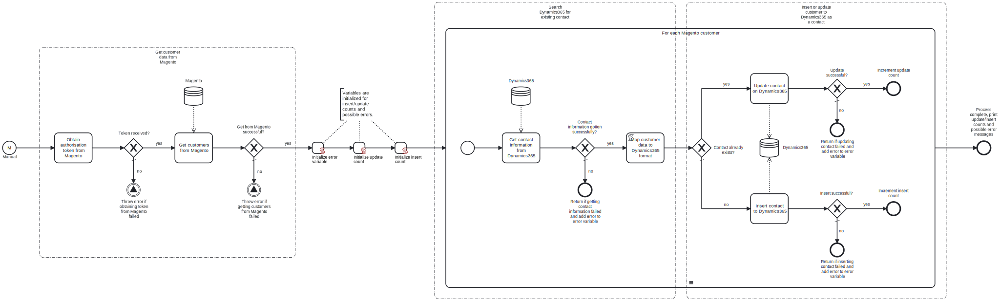

This template fetches customers from Adobe Commerce / Magento and inserts or updates them to Dynamics365 as contacts.
Using this template you can synchronize customers from Adobe Commerce / Magento to Dynamics365.

# Prerequisites

This template assumes that the following prerequisites are in place:

- The Magento user should be eligible to obtain an admin authorization token from Magento.
- The Dynamics365 user should have access to the client and tenant IDs and the client secret.

# Implementation and Usage Notes

This template fetches all customers from Magento, and then either inserts or updates them as contacts in Dynamics365. To determine if a Magento customer already has a corresponding contact in Dynamics365, the email addresses of the Magento customers are compared to those of the existing contacts in Dynamics365.

Customers that have been deleted from Magento are not transferred.

The credentials and URLs for connecting to both Magento and Dynamics365 are supplied to the template through defining the values in the corresponding process variables.

# Error Handling

This template checks for errors after every task and proceeds accordingly. If, for example, a customer is unable to be inserted to Dynamics365, the execution proceeds to the next customer and an error message is added to the error variable which is printed at the end of the execution.

This template does not handle transient errors separately. If such errors are expected, retries for e.g., the Magento connections can be configured in the corresponding tasks.