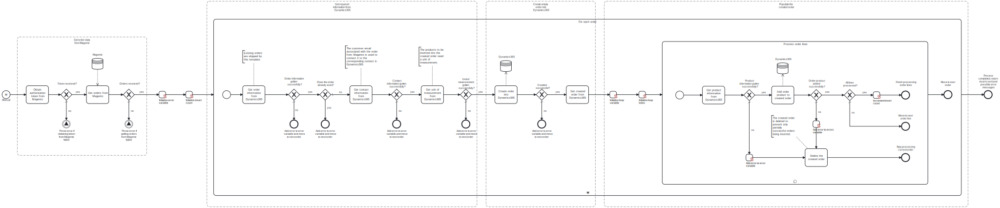

This template process retrieves orders from **Magento** and inserts them into **Dynamics365**.
Using this template, you can synchronize orders from Magento to Dynamics365.

# Prerequisites

This template assumes that the following prerequisites are in place:

- The Magento user should be eligible to obtain an admin authorization token from Magento.
- The Dynamics365 user should have access to the client ID, client secret, and tenant ID for the Dynamics365 instance.
- The products in the orders have already been imported to Dynamics365 using the template for that.
- The desired unit of measurement for the orders must exist in Dynamics365.

# Implementation and Usage Notes

To insert orders into Dynamics365, a unit of measurement has to be defined for the products in the orders. By default, this process uses a unit of measurement called "Primary Unit", but this behavior can be changed to another unit in the corresponding task. In any case, the desired unit of measurement, be it the default Primary Unit or another one, has to exist in Dynamics365.

The products in the orders to be inserted must also be in a Price List on Dynamics365, to correctly determine their price. This template assumes that the products are already in a price list. If you have imported the products from Magento to Dynamics365 using the template, the products should already be in a price list called "Magento Price List".

The orders inserted into Dynamics365 using this template have an ID starting with "MAG" (as in Magento) followed by their ID from Magento, e.g., "MAG11". Similarly, the names of the imported orders begin with "Magento order" followed by their ID from Magento, e.g., "Magento Order 10".

Existing orders are not updated by this template. Whether an order already exists is checked by comparing the IDs of the orders.

Process variables include fields for both Magento and Dynamics365 credentials and the addresses of the instances.

# Error Handling

There are error checks after each task where information is retrieved or sent. If a task is not successful, an error message will be appended to an exception variable and displayed at the end of the process. If an error occurs when trying to insert an order, the process will move on to the next order. However, if inserting a product into an order fails, the process throws an error and stops, in order to avoid orders being imported only partially i.e., with lines missing from them.

Transient errors are not handled in this template, but if they are expected, retries for e.g., getting the order information from Magento can be configured in the corresponding tasks.