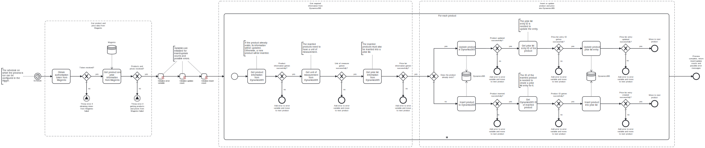

This template process retrieves information of products and their prices from **Magento** and either inserts or updates them into **Dynamics365**.
Using this template, you can synchronize products and their prices from Magento to Dynamics365.

# Prerequisites

This template assumes that the following prerequisites are in place:

- The Magento user should be eligible to obtain an admin authorization token from Magento.
- The Dynamics365 user should have access to the client ID, client secret, and tenant ID for the Dynamics365 instance.
- The desired unit of measurement for the products must exist in Dynamics365.
- A Price List called "Magento Price List" has been created in Dynamics365 with the desired currency.

# Implementation and Usage Notes

To insert products into Dynamics365, a unit of measurement has to be defined for the products. By default, this process uses a unit of measurement called "Primary Unit", but this behavior can be changed to another unit in the corresponding task. In any case, the desired unit of measurement, be it the default Primary Unit or another one, has to exists in Dynamics365.

The products to be inserted or updated must also be connected to a Price List on Dynamics365, to correctly determine their price. This template assumes that a Price List called "Magento Price List" has been created into Dynamics365 before using it. The process will then insert the products into the Price List. The currency selected for the Price List determines the currency the products will use for their prices. Another Price List can be used by changing the corresponding tasks.

To determine whether a product should be inserted or updated in Dynamics365, the Product IDs of the existing products are compared to the ones to be inserted or updated. Products that have already been imported by this process will have an ID beginning with "MAG" (as in Magento), followed by their ID number from Magento, e.g., MAG15. The process uses these IDs to determine if a product already exists in Dynamics365.

Process variables include fields for both Magento and Dynamics365 credentials and the addresses of the instances.

# Error Handling

There are error checks after each task where information is retrieved or sent. If a task is not successful, an error message will be appended to an exception variable and displayed at the end of the process. If an error occurs when trying to insert or update a product, the process will move on to the next product.

Transient errors are not handled in this template, but if they are expected, retries for e.g., getting the product information from Magento can be configured in the corresponding tasks.