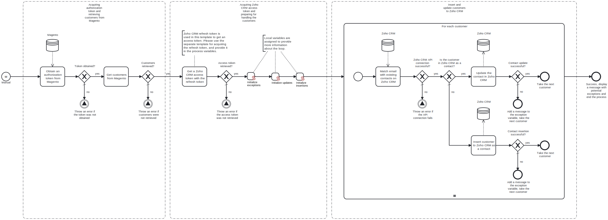

This template exports customers from Adobe Commerce / Magento and inserts or updates them to Zoho CRM as contacts.

Using this template, you can synchronize customers from Adobe Commerce / Magento to Zoho CRM.

# Prerequisites

This template assumes that the following prerequisites are in place:

- The Magento user should be eligible to obtain an admin authorization token from Magento.
- Zoho CRM client ID and client secret should be accessible and provided in the process variables to create the access token.
- The Zoho CRM refresh token has been generated and provided as a process variable. A refresh token can be generated using a corresponding template.
- Zoho CRM regional instances for account and API are known, and the domains are adjusted accordingly.
# Implementation and Usage Notes

This template requires a refresh token for the Zoho API in order to function. The template will use the refresh token to create the access token for accessing the API. The refresh token can be created using the "Zoho CRM - Exchange grant token for refresh token" template. For this template, the token should have the following scopes included: **ZohoCRM.modules.contacts.READ**, **ZohoCRM.modules.contacts.CREATE** and **ZohoCRM.modules.contacts.UPDATE**.

The access token to Magento is created first to retrieve customers from Magento. Then an access token for Zoho CRM is created. The required credentials to obtain both tokens should be provided in process variables.

All customers from Magento, deleted customers excluded, are either inserted or updated in Zoho CRM as contacts. To determine if a Magento customer already has a corresponding contact in Zoho CRM, the email addresses of the Magento customers are compared to those of the existing contacts in Zoho CRM.

Process variables include credentials and URLs for connecting to both Magento and Zoho CRM.

# Error Handling

This template checks for errors after every task. Errors during customer handling are stored in the exception variable. If, for example, a customer is unable to be inserted to Zoho CRM, the execution proceeds to the next customer and an error message is added to the exception variable. The exception variable is then printed at the end of the process.

Transient errors are not handled separately. If they are expected, retries for connections to Magento and Zoho CRM can be enabled from the tasks.