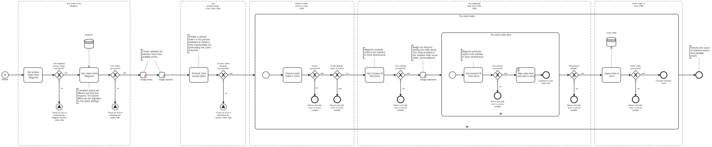

This template process retrieves order data from Adobe Commerce / Magento and uploads each order into Zoho CRM as sales orders.

# Prerequisites

This template assumes that the following prerequisites are in place:

- The Magento user is eligible to obtain an access token from Magento.
- The Zoho CRM client ID and client secret are accessible.
- The domain for the Zoho instance (e.g. EU or USA) is identified.
- A Zoho CRM refresh token with an adequate scope has been generated using the "Zoho CRM - Exchange grant token for refresh token" template. For this template, the token should be configured with the scopes `ZohoCRM.modules.salesorders.READ`, `ZohoCRM.modules.salesorders.CREATE`, `ZohoCRM.modules.contacts.READ` and `ZohoCRM.modules.products.READ`.
- Magento customers are already integrated in Zoho CRM as contacts.
- Magento products are already integrated in Zoho CRM with the Zoho product code set with the prefix "MAG", followed with the product's Magento ID.

# Implementation and Usage Notes

Before retrieving the Magento order data, an access token for authenticating the request is obtained from the Magento API. This template filters out Magento orders with the status "canceled". 

Accessing the Zoho CRM API also requires an access token, which is obtained with a refresh token provided in the process variables. To generate a refresh token, you can use the corresponding "Zoho CRM - Exchange grant token for refresh token" template. The refresh token does not have an expiration time, so it can be used multiple times.

Zoho CRM has separate API domains for different geographical areas, and requests need to be sent to the same domain as the instance. The domain URLs can be set in the process variables.

The template only handles the insertion of new orders in Zoho CRM. Orders are matched by the subject attribute, which includes the prefix "Magento Order" followed by the order's Magento entity ID. If an order with a matching subject is found, it will be ignored, and the process will continue to the next order.

This template links the orders to contacts and order items to products by retrieving their Zoho IDs in separate requests. For this reason, the template loops through each order item, performs the necessary mapping and stores them in an array for insertion. The rest of the created order's attributes are mapped in the insert task's message field, where they can be customized if needed.

# Error Handling

This template does not handle transient errors separately. Each request to Magento and Zoho CRM is checked for errors. If uploading an individual order fails, the process moves on to the next one, and an error notification is added to the result message.
